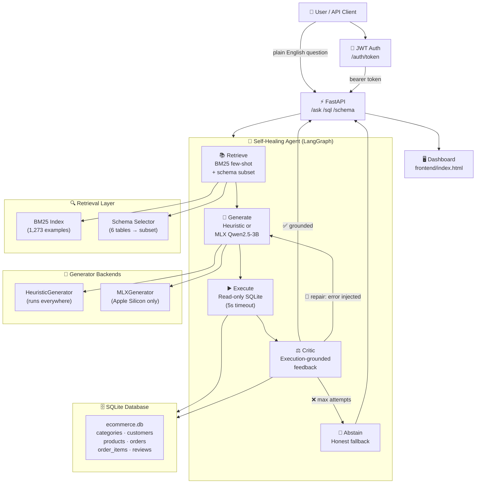
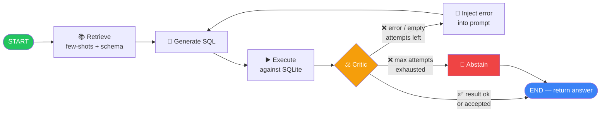
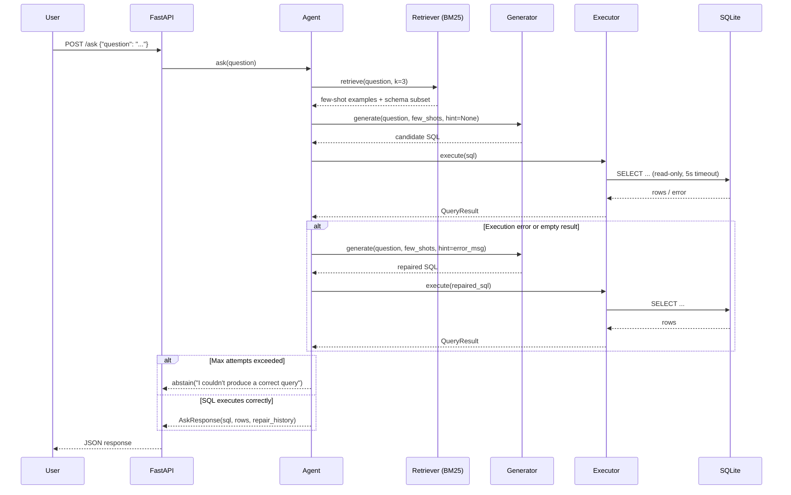
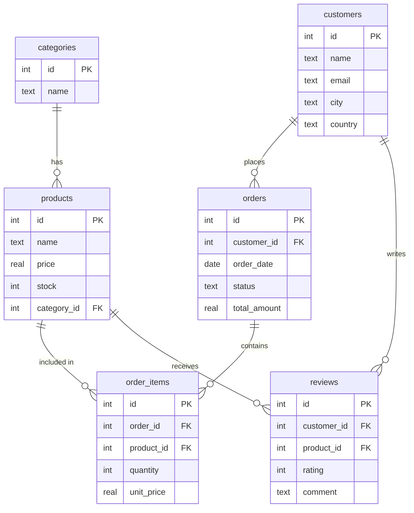

# SQLMender

> **A self-correcting, fine-tuned Natural-Language-to-SQL agent.**  
> Ask a question in plain English — SQLMender retrieves context, generates SQL, executes it, and heals itself on failure. The database is the critic.

<p align="center">
  
  
  
  
  
  
</p>

---

## What is SQLMender?

SQLMender unifies **three AI techniques** into one end-to-end system:

| Layer | Technique | Purpose |
|---|---|---|
| **Retrieval** | BM25 few-shot + schema subset selection | Ground the prompt with relevant examples & tables |
| **Generation** | Fine-tuned 4-bit Qwen2.5-3B (MLX LoRA, rank 16) | Produce candidate SQL |
| **Self-Correction** | LangGraph agentic loop with execution feedback | Heal bad queries or abstain honestly |

The core insight: **the database is the critic.** Instead of asking an LLM to grade its own output, SQLMender executes the SQL against a real SQLite database and feeds execution errors directly back into the next generation step.

---

## Architecture

### System Overview



### Agent Self-Correction Loop



### Request Sequence



---

## Database Schema

The synthetic e-commerce database (`data/ecommerce.db`):



**Record counts** (deterministic seed): categories: 8 · customers: 210 · products: 220 · orders: 300 · order_items: 746 · reviews: 250

---

## Features

- **Self-healing agent** — Automatically repairs SQL on execution errors (up to 3 attempts)
- **Execution-grounded feedback** — Database errors drive correction, not LLM self-grading
- **BM25 few-shot retrieval** — Semantically relevant examples from 1,273 training pairs
- **Schema subset selection** — Only relevant tables fed to the model (scales beyond toy schemas)
- **Dual generator backends** — MLX fine-tuned model on Apple Silicon; deterministic heuristic everywhere else
- **Multi-layer SQL safety** — sqlglot AST check + SQLite read-only file URI + 5s timeout + 1000-row cap
- **Production-ready API** — FastAPI with JWT auth, health check, schema endpoint
- **Dark agent console** — Single-file dashboard with live self-healing trace viewer
- **79% test coverage** — 56 tests across all agent paths, API, retrieval, SQL safety

---

## Tech Stack

| Category | Technology |
|---|---|
| **Language** | Python 3.11+ |
| **API Framework** | FastAPI 0.111+, Uvicorn 0.30+ |
| **Agent Framework** | LangGraph 0.2+, LangChain Core 0.3+ |
| **SQL Parsing** | sqlglot 25.0+ |
| **Retrieval** | rank-bm25 0.2.2+ |
| **Validation** | Pydantic 2.7+, pydantic-settings 2.3+ |
| **Auth** | python-jose[cryptography] 3.3+ (JWT) |
| **Logging** | loguru 0.7.2+ |
| **ML (Apple Silicon)** | MLX 0.18+, mlx-lm 0.18+ |
| **Base Model** | Qwen2.5-3B-4bit (LoRA rank 16, lr 1e-5, 600 iters) |
| **Testing** | pytest 8.2+, pytest-cov 5.0+, httpx 0.27+ |
| **Linting** | ruff 0.4+, black 24.4+ |
| **Database** | SQLite (e-commerce schema, deterministic seed) |
| **Frontend** | Vanilla HTML/CSS/JS (single file, dark theme) |

---

## Quickstart

### Prerequisites

- Python 3.11+
- macOS with Apple Silicon (optional, for MLX fine-tuning)

### Install & Run

```bash
# 1. Clone the repo
git clone https://github.com/AshuGuptaz/SqlMendor.git
cd SqlMendor

# 2. Install dependencies
make install          # creates venv, editable install, dev tools

# 3. Build the database and dataset
make data             # ecommerce.db + 1,414 NL-SQL pairs + MLX prep files

# 4. Start the API + dashboard
make dev              # → http://localhost:8000
```

### Fine-tuning (Apple Silicon M1/M2/M3)

```bash
make train            # LoRA fine-tune: Qwen2.5-3B-4bit, rank 16, 600 iters
make eval             # run agent over 141 test examples → outputs/eval.json
```

When a trained adapter is present and MLX is importable, the agent automatically switches to the fine-tuned model. Otherwise it falls back to the **heuristic generator** — the full pipeline (API, tests, agent loop) runs anywhere.

---

## Usage

### Dashboard

Open **http://localhost:8000** after `make dev` for the interactive dark console with live self-healing trace.

### REST API

**1. Get a token:**
```bash
TOKEN=$(curl -s -X POST localhost:8000/auth/token \
  -d "username=demo&password=demo-password" \
  | python -c "import sys,json; print(json.load(sys.stdin)['access_token'])")
```

**2. Ask a question:**
```bash
curl -s -X POST localhost:8000/ask \
  -H "Authorization: Bearer $TOKEN" \
  -H "Content-Type: application/json" \
  -d '{"question": "What are the top 5 most expensive products?"}' \
  | python -m json.tool
```

**Sample Response:**
```json
{
  "sql": "SELECT name, price FROM products ORDER BY price DESC LIMIT 5",
  "columns": ["name", "price"],
  "rows": [["UltraWidget Pro", 499.99], ["..."]],
  "attempts": 1,
  "status": "ok",
  "history": []
}
```

**3. Direct SQL execution:**
```bash
curl -s -X POST localhost:8000/sql \
  -H "Authorization: Bearer $TOKEN" \
  -H "Content-Type: application/json" \
  -d '{"sql": "SELECT COUNT(*) FROM orders WHERE status = '\''completed'\''"}' \
  | python -m json.tool
```

### API Reference

| Method | Path | Auth | Description |
|---|---|---|---|
| `GET`  | `/health` | — | Liveness probe |
| `GET`  | `/schema` | JWT | Returns full schema description |
| `POST` | `/ask` | JWT | Self-healing NL→SQL agent |
| `POST` | `/sql` | JWT | Direct read-only SELECT execution |
| `POST` | `/auth/token` | — | Demo login → bearer token |

---

## Results & Metrics

| Metric | Heuristic baseline | Fine-tuned MLX (Qwen2.5-3B) |
|---|---|---|
| **Execution accuracy** | 16.3% | **53.9%** |
| Predicted-query execution rate | 100% | 56.0% |
| Grounded on first try | 141 / 141 | 46 / 141 |
| Repaired successfully | 0 | 33 / 141 |
| Abstained (honest) | 0 | 62 / 141 |
| **Dataset** | 1,414 pairs (1,273 train / 141 test), 0 non-executing | — |
| **Test suite** | 56 passing, 79% coverage | — |
| **Training** | — | rank 16 LoRA, 600 iters, 2.7GB peak, Apple M1 |

**+37.6 percentage points lift** from fine-tuning (16.3% → 53.9%).

> Abstentions are intentional — the agent declines rather than return wrong SQL. The repair loop salvaged 33 queries that failed on first attempt.

---

## Project Structure

```
sqlmender/
├── src/sqlmender/
│   ├── config.py              # Pydantic settings (DB path, LoRA params, agent config)
│   ├── schemas.py             # API request/response models
│   ├── db/
│   │   ├── build_db.py        # Builds SQLite with deterministic seed
│   │   ├── seed.py            # Data generation
│   │   └── schema_info.py     # Human-readable schema description
│   ├── sql/
│   │   ├── normalizer.py      # sqlglot AST parsing & normalization
│   │   └── executor.py        # Multi-layer read-only executor
│   ├── retrieval/
│   │   ├── example_index.py   # BM25 few-shot retrieval
│   │   └── schema_index.py    # Relevant table subset selection
│   ├── llm/
│   │   ├── prompts.py         # Agent prompt construction
│   │   ├── generator.py       # HeuristicGenerator + MLXGenerator
│   │   └── critic.py          # Execution-grounded verdict
│   ├── agent/
│   │   ├── state.py           # LangGraph AgentState TypedDict
│   │   ├── nodes.py           # retrieve / generate / execute / critic / abstain
│   │   ├── edges.py           # Conditional routing logic
│   │   └── graph.py           # LangGraph assembly + ask() entrypoint
│   ├── train/
│   │   ├── templates.py       # SQL template families (8 categories)
│   │   ├── data_gen.py        # 1,414 NL-SQL pairs with paraphrasing
│   │   ├── prompt.py          # Shared train/inference prompt format
│   │   ├── prepare_mlx.py     # Convert JSONL → MLX format
│   │   ├── train.py           # LoRA fine-tuning (Apple Silicon)
│   │   └── infer.py           # Inference with trained adapter
│   ├── eval/
│   │   └── metrics.py         # Execution accuracy (order-insensitive)
│   └── api/
│       ├── auth.py            # JWT creation/verification
│       ├── routes.py          # FastAPI endpoints
│       └── main.py            # App factory + frontend mount
├── frontend/
│   └── index.html             # Dark agent console (22KB, single file)
├── tests/                     # 56 tests, 79% coverage
│   ├── test_agent.py          # Happy/repair/abstain paths
│   ├── test_api.py            # Endpoint integration + JWT
│   ├── test_executor_safety.py # Rejects INSERT/UPDATE/DELETE/DROP
│   ├── test_normalizer.py
│   ├── test_retrieval.py
│   ├── test_generator.py
│   ├── test_metrics.py
│   └── ...
├── scripts/
│   └── run_eval.py            # Evaluation runner → outputs/eval.json
├── data/
│   ├── ecommerce.db           # Built by `make data`
│   ├── train.jsonl            # 1,273 training pairs
│   └── test.jsonl             # 141 test pairs
├── adapters/sql-lora/         # Trained LoRA weights (Apple Silicon)
├── outputs/
│   ├── eval.json              # Evaluation results
│   └── RESULTS.md             # Measured metrics
├── Makefile                   # All commands (install/data/train/eval/test/dev)
├── pyproject.toml             # Dependencies + project metadata
├── DECISIONS.md               # Design decisions & trade-offs
├── BLOCKERS.md                # Environment gates (MLX, external LLM)
└── PROGRESS.md                # Build log + acceptance checklist
```

---

## Design Decisions

See [DECISIONS.md](DECISIONS.md) for full context. Key choices:

1. **Database as critic** — Real execution errors drive repair, not LLM self-grading
2. **Heuristic baseline + MLX upgrade** — Full pipeline works everywhere; fine-tune is a drop-in upgrade
3. **Runnable ≠ correct** — Execution rate and accuracy reported separately
4. **Multi-layer SQL safety** — sqlglot AST + read-only SQLite URI + timeout + row cap
5. **Prompt parity** — `train/prompt.py` shared between training and inference
6. **Execution-validated dataset** — Every training pair tested against the real DB (0 broken pairs)
7. **LangGraph state graph** — Compiled graph with dependency injection for testability
8. **Same-origin dashboard** — Uvicorn serves both API and UI, no CORS complexity

---

## Make Commands

```bash
make install    # Create venv, editable install, dev dependencies
make data       # Build DB, generate 1,414 NL-SQL pairs, prep MLX files
make train      # LoRA fine-tune on Apple Silicon (MLX required)
make eval       # Run agent over test set → outputs/eval.json
make test       # Run 56 tests with coverage report
make lint       # ruff check
make fmt        # black + ruff --fix
make dev        # Start API server at http://localhost:8000
```

---

## License

MIT

---

<p align="center">
  Built with LangGraph · MLX · FastAPI · sqlglot · BM25
</p>
